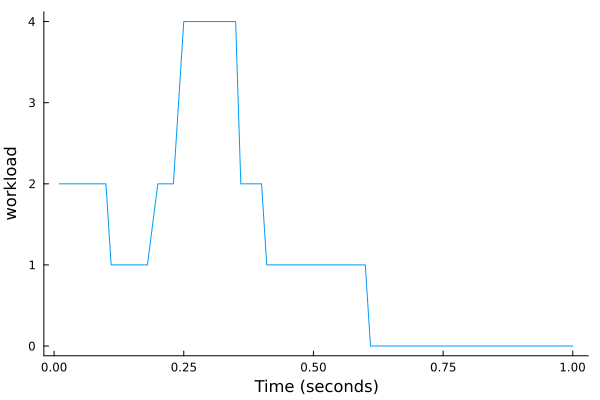

# CognitiveWorkload

This is a small package for computing for estimating cognitive workload from a cognitive model. Mean workload can be estimated over a large interval with `compute_mean_workload` or at a desired temporal resolution with `compute_workload`. 

# Example

```julia 
using CognitiveWorkload
using Plots

modules = [:procedural,:declarative,:imaginal,:motor,:visual]
weights = [2.0, 4.0, 4.0, 1.0, 1.0]
res = .01 #seconds
start_time = 0.0
end_time = 1.0
activity = Activity[]

a = Activity(;start_time=0.0, end_time=.05, idx=1, Module="procedural")
push!(activity, a)

a = Activity(;start_time=0.05, end_time=.10, idx=1, Module="procedural")
push!(activity, a)

a = Activity(;start_time=0.1, end_time=.185, idx=5, Module="visual")
push!(activity, a)

a = Activity(;start_time=0.185, end_time=.235, idx=1, Module="procedural")
push!(activity, a)

a = Activity(;start_time=0.235, end_time=.350, idx=2, Module="declarative")
push!(activity, a)

a = Activity(;start_time=0.350, end_time=.400, idx=1, Module="procedural")
push!(activity, a)

a = Activity(;start_time=0.400, end_time=.600, idx=4, Module="motor")
push!(activity, a)

workload,_ = compute_workload(activity, res, weights, start_time, end_time)
plot(res:res:end_time, workload, grid=false, leg=false, xlabel="Time (seconds)", ylabel = "workload", size=(600,400))
```

